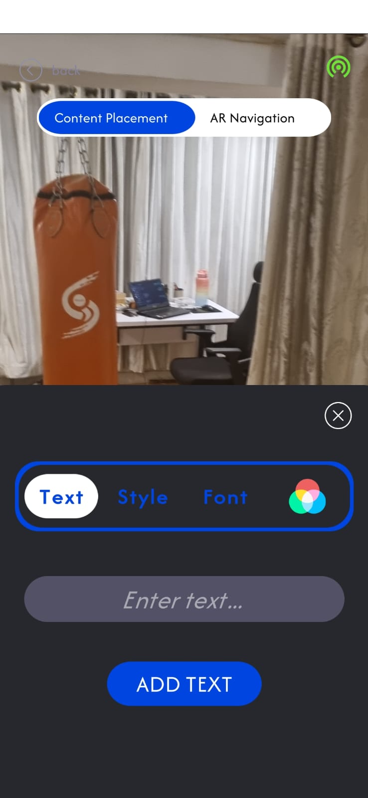
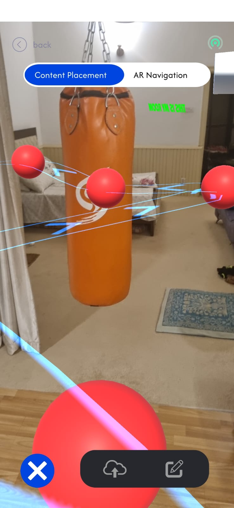
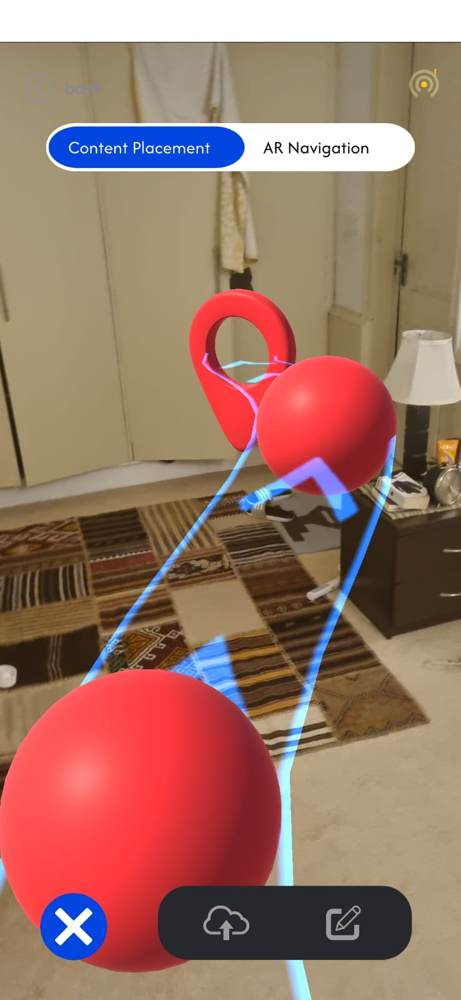
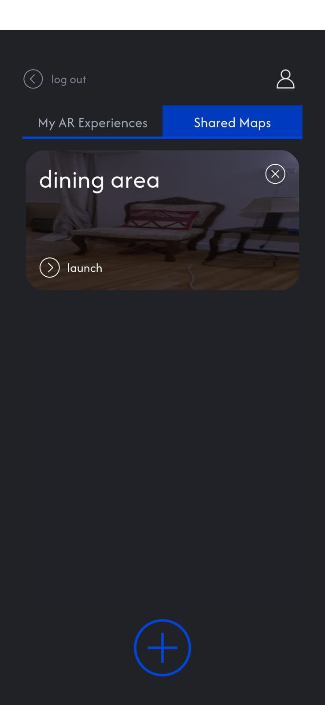

# Wander-AR
 

Wander is a mobile application designed for indoor navigation  through the use of Augmented Reality, working on the principles of Computer Vision and Visual Positioning System (VPS), to provide on-screen directions for users in real-time.

## Features

- Login/Signup via Email: Default form for user authentication using Google sign-in.

  

- Environment Mapping: Surrounding area is scanned using pictures taken by a phone's camera to build a 3D point cloud model.

  
   

- Content Placement: Involves positioning virtual elements, like text and images, within the real environment through spatial anchoring and localization techniques. 

  
   
   

- AR Navigation:
  - Placing Virtual Waypoints: Real-time virtual pointers for precise guidance.

  
   

  - Navigation Pathfinding: Navigational Graph is created and shortest path is calculated using A* algorithim.

  
   

- Home Screen: Retrieves all private and public map information from the firestore database and allows users to add new maps to the collection.

  
   

 
## SDK & APIs Used

- Immersal SDK: It is a spatial mapping & visual positioning system. It allows merging digital content with the real world by precise localization of devices in the physical world. 
- GoogleSignIn API: Provides users easy and secure sign-in and sign-up, in an easy-to-implement package for developers.
- Firebase Auth: Provides backend services UI libraries to authenticate users to our app.

## Technology

The project is built using the following technologies:

- Software: Unity
- Language: C#
- Backend: Firebase, ImmersalSDK

## License

Wander is licensed under the [MIT License](LICENSE).

## Contact

For questions or suggestions, please reach out to us at [moosathebutt@gmail.com](mailto:moosathebutt@gmail.com) or [aminawasif20@gmail.com](mailto:aminawasif20@gmail.com) .

---